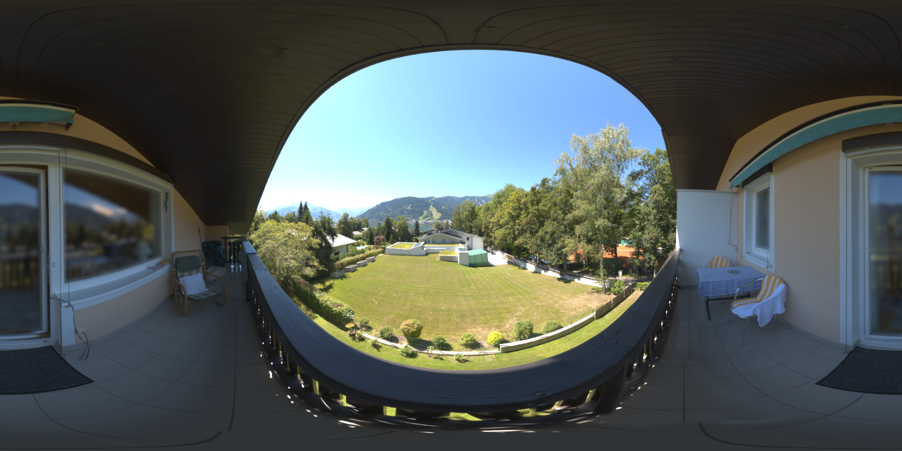
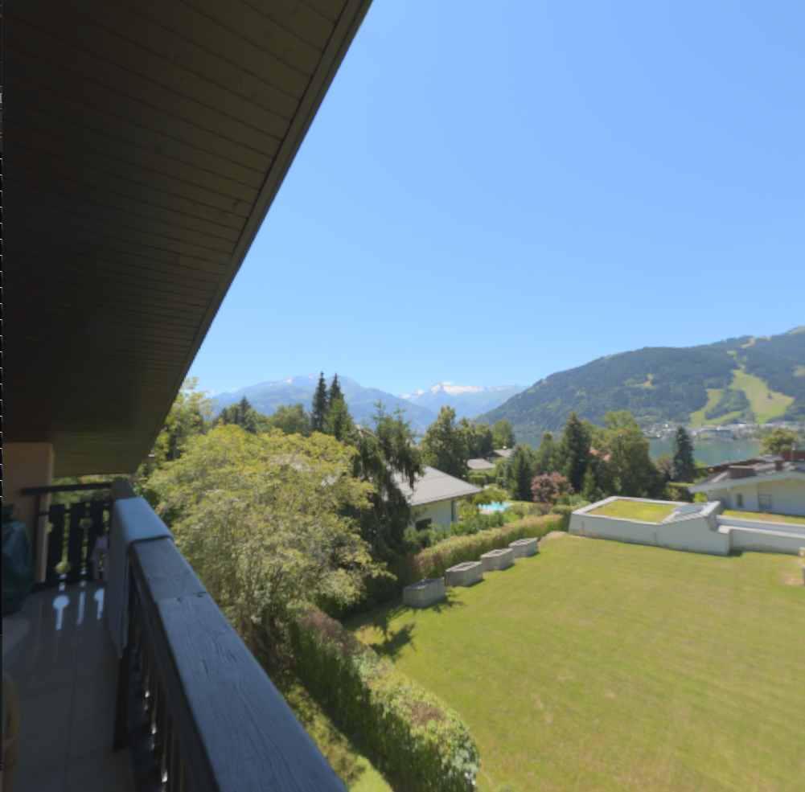
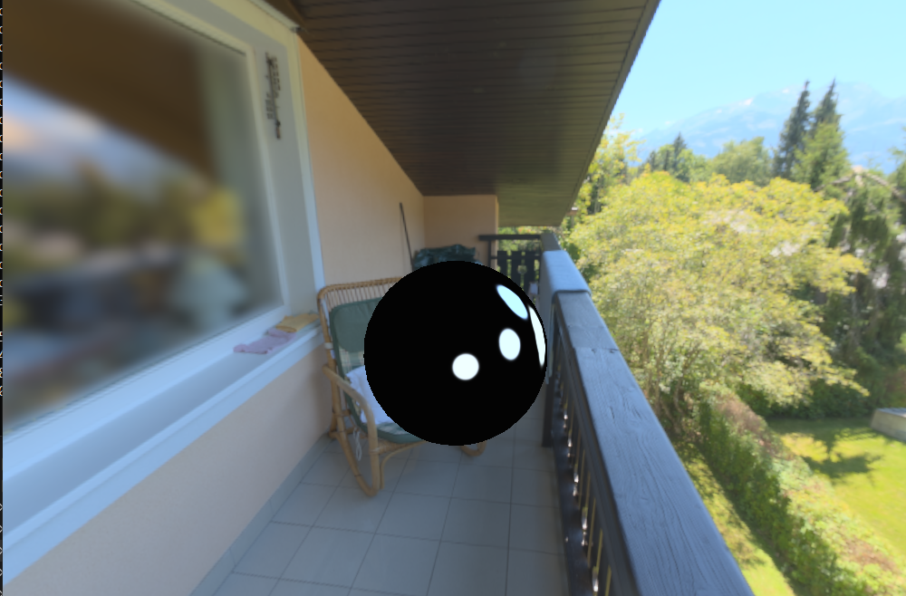

# Computer Graphics II - Homework II
## Skybox Generation
 
This was a task that I'd never done before so naturally my first move was to search through the internet to implement the skybox. Both slides and the sources I found on the internet were an implementation that does not apply to my case with their current state. All of them were generating the skybox from the six image files of an already prepared cube map. However, first I had to map the HDR equirectangular image to a cube map, and then generate the skybox from the cube map, so I learned the math behind it and then got to work.

My approach was putting the camera to the center of the world, making it look at the face of a cube (that is also at the center of the world, aligned with the axes and has an edge length of 1) and performing an off-screen rendering to capture the corresponding face's texture and repeat the process for the rest of 5 faces of the cube. The resulting texture was my texture for the skybox. Here is the fragment shader that maps the equirectangular image to the skybox faces' : 

```glsl
#version 460 core

out vec4 FragColor;

in vec3 fragWorldPos;

uniform sampler2D equirectangularMap;

const float PI = 3.14159265359;

void main()
{       
    vec3 direction = normalize(fragWorldPos); 
    float u = 0.5 + atan(direction.z, direction.x) / (2.0 * PI);    
    float v = 0.5 - asin(direction.y) / PI;
    vec3 color = texture(equirectangularMap, vec2(u, v)).rgb;
    FragColor = vec4(color, 1.0);
}
```
## Environment Lightning

 

The algorithm was very straightforward: The highest energy points of the image are selected as light positions and lights are generated to enlighten the environment and the objects. To be more specific; the surrounding image of the scene's centroid must be found. The centroid is the point where the region is divided into two parts that have the same energy level both horizontally and vertically. Then a light is generated at the position of the centroid, and its color value must be the total color value of the region (not average, the sum). That was just the 0th level of the algorithm which means 0 division and a `2^0` number of lights. If the level increases, instead of generating the light from the centroid, we must divide the region from the centroid and the longest dimension, and then apply the same process for the resulting regions and generate `2` lights from their centroids and so on. 

The level of the algorithm i.e, number of the lights must be increased and decreased with keyboard inputs in the runtime. Due to the performance limitations, the maximum number of lights for us to implement was `2^7 = 128 `. This limitation was the main element that formed my implementation. Since it is limited, my approach was to generate all light information of all the levels before rendering and storing them, then according to the keyboard input, switch between the lights. Maybe it takes a bit longer time in the beginning, but sacrificing a little memory to not needing to calculate the light information whenever the level changes, enhances the overall performance (I didn't implement the dynamic way so I didn't compare and cannot give you numerical data regarding to performance, but due to my experience I believe this way is better.).  

To implement, I stored a 2D vector holding a `LightSource` struct.
```cpp
    struct LightSource
    {
    	glm::vec2 position; 
    	float pad1;
    	float pad2;
    	glm::vec3 color;  
    	float intensity;
    };
```
The first dimension's size is 8 and the index corresponds to the light info of the level. For example, `allLights[3]` correspond to the information of the `8` light source. In my recursive approach of `Median Cut`, first, I start with the level `0` i.e the whole image, calculate the centroid, create an instance of `LightSource`, fill its data, and push it to the `allLights[0]`. After that, I calculate the sub-regions, determine their borders, and call the function again for these child sub-regions with increased depth. When the depth reaches the `MAX_DEPTH` the function returns and all the data have been initialized. 
Here are the `Region`struct and `Median Cut` function:

```cpp
    struct Region
    {
    	glm::vec2 start;
    	glm::vec2 end;
    	glm::vec2 centroid;
    	float energy;
    	Region* LeftSub;
    	Region* RightSub;
    };
```

```cpp
void Light::medianCut(int depth, Region* region)
{
    if (depth > MAX_DEPTH)
    {
        return;
    }
    if (depth == 0)
    {
        //this means this is the first so I set the start and end manually
        //except this level, all levels' regions' start and end will be set
        //by the parent region before the medianCut is called for them
        region->start = glm::vec2(0, 0);
        region->end = glm::vec2(width - 1, height - 1);
    }
    int x0 = region->start.x, y0 = region->start.y, x1 = region->end.x, y1 = region->end.y;

    region->energy = SAT[y1][x1]
                    - (x0 > 0 ? SAT[y1][x0 - 1] : 0)
                    - (y0 > 0 ? SAT[y0 - 1][x1] : 0)
                    + (x0 > 0 && y0 > 0 ? SAT[y0 - 1][x0 - 1] : 0);

    float halfEnergy = region->energy / 2.0f;
    //if energy is zero on some rows or columns, there will maybe occur problems
    int halfX = x0;
    
    for ( ; halfX <= x1; halfX++)
    {
        float currentEnergy = SAT[y1][halfX]
                            - (x0 > 0 ? SAT[y1][x0 - 1] : 0)
                            - (y0 > 0 ? SAT[y0 - 1][halfX] : 0)
                            + (x0 > 0 && y0 > 0 ? SAT[y0 - 1][x0 - 1] : 0);
        if (currentEnergy >= halfEnergy)
        {
            break;
        }
    }
    int halfY = y0;
    for (; halfY <= y1; halfY++)
    {
        float currentEnergy = SAT[halfY][x1]
                            - (x0 > 0 ? SAT[halfY][x0 - 1] : 0)
                            - (y0 > 0 ? SAT[y0 - 1][x1] : 0)
                            + (x0 > 0 && y0 > 0 ? SAT[y0 - 1][x0 - 1] : 0);

        if (currentEnergy >= halfEnergy)
        {
            break;
        }
    }
    region->centroid = glm::vec2(halfX, halfY);
    LightSource light;
    light.position = glm::vec2(halfX / float(width), halfY / float(height));

    glm::vec3 colorSum = glm::vec3(0.0f);
    for (int y = y0; y <= y1; y++)
    {
        for (int x = x0; x <= x1; x++)
        {
            int idx = y * width + x;
            float cosWeight = cos(M_PI / 2.0f * abs(y - height / 2) / (height / 2));
            colorSum += cosWeight * glm::vec3(m_data[3 * idx], m_data[3 * idx + 1], m_data[3 * idx + 2]);
        }
    }

    float area = (float)((x1 - x0 + 1) * (y1 - y0 + 1));


    //light.color = (area > 0) ? colorSum / area : glm::vec3(0.0f);
    light.color = colorSum;

    light.intensity = (area > 0) ? area : 0.0f;
    allLights[depth].push_back(light);

    if (depth == MAX_DEPTH)
    {
        return;
    }

    region->LeftSub = new Region();
    region->RightSub = new Region();

    if (x1 - x0 > y1 - y0)
    {
        //longest dimension is x
        

        region->LeftSub->start = glm::vec2(x0, y0);
        region->LeftSub->end = glm::vec2(halfX, y1);

        region->RightSub->start = glm::vec2(halfX + 1, y0);
        region->RightSub->end = glm::vec2(x1, y1);
   
    }
    else
    {
        //longest dimension is y
        

        region->LeftSub->start = glm::vec2(x0, y0);
        region->LeftSub->end = glm::vec2(x1, halfY);

        region->RightSub->start = glm::vec2(x0, halfY + 1);
        region->RightSub->end = glm::vec2(x1, y1);
    }

    medianCut(depth + 1, region->LeftSub);
   

    medianCut(depth + 1, region->RightSub);
    delete region->LeftSub;
    delete region->RightSub;
}
```

I passed the light data to the shaders via `Uniform Buffer Object`. When the user updates the level of the algorithm, `updateLevel(int num)` method is called, and updates the `UBO`data by passing the `level`th vector of `allLights`. 

# Tone Mapping

Since we are rendering HDR images, without tone-mapping we would not get nice visuals. To implement tone-mapping, instead of rendering the scene to the screen, first, we must take an off-screen render and capture the scene to a buffer, and use it as a texture for a fullscreen quad to show on the screen.

First, we set the fragment colors of the skybox and the object to their `log(resultingColor)` before rendering them to the framebuffer. Then, we generate a `mipmap` of the resulting texture to find the average color of the scene (what I mean by saying the scene is that what we see in just one frame, a quad). After that, we use this information to scale the scene's luminance so that when we are looking different light levels, we see changing and more realistic luminance. 

The calculations to do the tone-mapping take place in the fragment shader of the full-screen quad: 

```glsl
    #version 460 core
    out vec4 FragColor;
    
    in vec2 TexCoords;
    
    uniform sampler2D screenTexture;
    uniform int mode = 1;
    uniform float exposure;
    
    void main()
    {
        
        float delta = 1e-5f;
        vec3 meanHdr = exp(textureLod(screenTexture, vec2(0.5, 0.5), 64).rgb);
        
        vec3 loggedHDRColor = texture(screenTexture, TexCoords).rgb;
        
        vec3 hdrColor = exp(loggedHDRColor);
           
        float lum = dot(hdrColor, vec3(0.2126, 0.7152, 0.0722)) + delta;
        float meanLum = (dot(meanHdr, vec3(0.2126, 0.7152, 0.0722))) + delta;
        float scaledLum = (lum / meanLum) * exposure;
        float lumTM = scaledLum / (scaledLum + 1.0);
        
        vec3 tmColor = clamp((lumTM / lum) * hdrColor, vec3(0, 0, 0), vec3(1, 1, 1));
        float p = 1.0 / 2.2;
        vec3 gcColor = vec3(pow(tmColor.r, p), pow(tmColor.g, p), pow(tmColor.b, p));
        
    
        FragColor = vec4(gcColor, 1.0);
        
    
    }

```
# Extras

Even though it was not wanted from us, I added some key controls to change the diffuse and specular coefficients of the lights so that in every skybox setting, users can adjust the lights to get a more desired result. (I didn't cap the values, so if you increase them more than enough, the objects in the scene become a sun and then crash the whole scene into a black screen, I purposefully didn't cap it to have a funny easter egg.) 

# Things That Cost Me Too Much Time

When I initializing the framebuffer to perform an off-screen render for tone-mapping, `glTexImage2D(GL_TEXTURE_2D, 0, GL_RGBA32F, m_WindowState.width, m_WindowState.height, 0, GL_RGBA, GL_FLOAT, NULL);` this line of code cost me 1 day as I didn't notice the third argument was `GL_RGB` and not `GL_RGBA32F` as now. It was clamping the values between `0`and `1` so when I tried to render the scene, all I could see was plain black. I questioned both myself and the calculations I made for tone-mapping, and I did every possible combination of calculation changes in tone-mapping to fix it without having any clue about what was actually causing the problem. 

And again, a couple of wrong arguments of OpenGL commands cost me another 1 day.
```glsl
    glTexParameteri(GL_TEXTURE_2D, GL_TEXTURE_MIN_FILTER, GL_NEAREST_MIPMAP_NEAREST);
    glTexParameteri(GL_TEXTURE_2D, GL_TEXTURE_MAG_FILTER, GL_NEAREST);
```
The above two lines' arguments were wrong and it wasn't performing the mipmap. Again I questioned the tone-map algorithm even though it was fine. The moment I fix those two lines, everything was suddenly fixed and the rest of the homework was done with ease.

# Some Results


